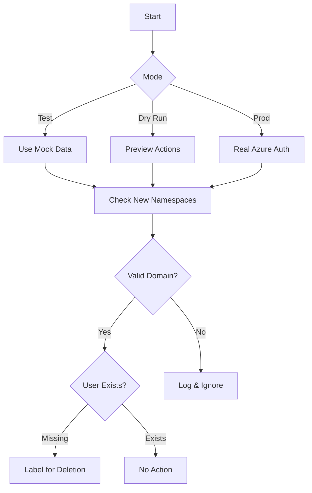
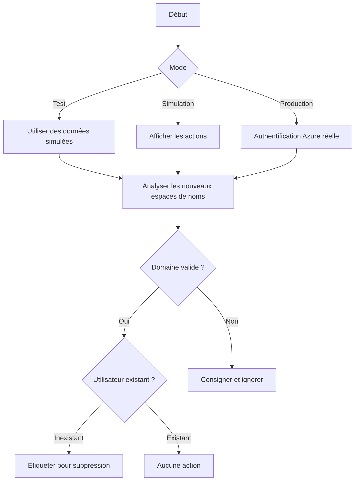
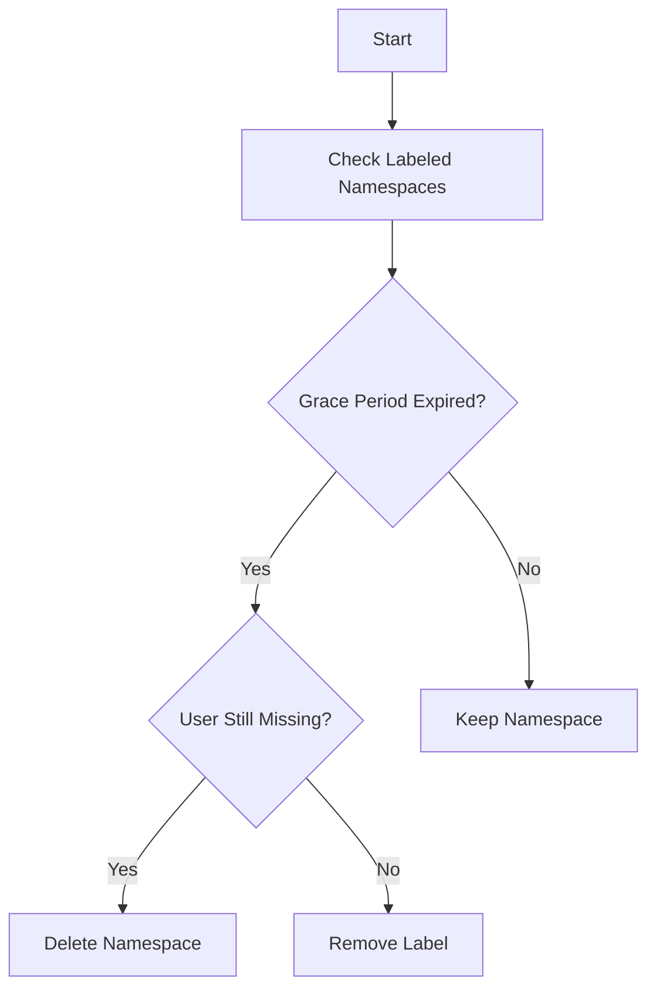
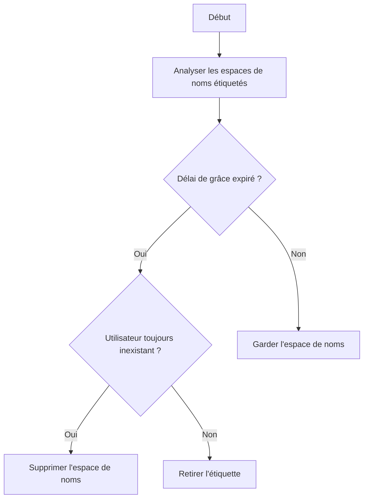

# Kubernetes Namespace Cleaner

[(Français)](#nettoyeur-de-namespaces-kubernetes)

## Kubernetes Namespace Cleaner

A Kubernetes CronJob that automatically detects and deletes namespaces associated with deprovisioned Azure Entra ID (formerly Azure AD) users.

### What is this project?

A lifecycle automation tool for Kubernetes namespaces. It identifies user-created namespaces, verifies user status through Azure Entra ID, and labels or deletes expired ones.

### How does it work?

It runs in two phases:

1. **Evaluation**: Identifies new namespaces and checks if the associated user is valid.
2. **Cleanup**: Deletes namespaces labeled for removal after a grace period, if the user is still missing.

It supports mock, dry-run, and production modes.

### Who will use this project?

Cluster administrators who need to enforce namespace hygiene and lifecycle policies in environments integrated with Entra ID, especially in multi-tenant Kubernetes platforms like Kubeflow.

### What is the goal of this project?

To safely and automatically manage orphaned namespaces, reduce security risk, and maintain cluster cleanliness without manual intervention.

---

#### Development Status


---

#### How to Contribute

See [CONTRIBUTING.md](CONTRIBUTING.md)

---

#### License

Unless otherwise noted, the source code of this project is covered under Crown Copyright, Government of Canada, and is distributed under the [GNU Affero General Public License](LICENSE).

The Canada wordmark and related graphics associated with this distribution are protected under trademark law and copyright law. No permission is granted to use them outside the parameters of the Government of Canada's corporate identity program. For more information, see [Federal identity requirements](https://www.canada.ca/en/treasury-board-secretariat/topics/government-communications/federal-identity-requirements.html).

---

## Nettoyeur de Namespaces Kubernetes

[(English)](#kubernetes-namespace-cleaner)

### Quel est ce projet?

Un CronJob Kubernetes qui détecte et supprime automatiquement les espaces de noms associés aux utilisateurs Azure Entra ID (anciennement Azure AD) déprovisionnés.

### Comment ça marche?

Le CronJob fonctionne en deux phases :

1. **Évaluation** : identifie les nouveaux espaces de noms et vérifie si l'utilisateur associé est valide.
2. **Nettoyage** : supprime les espaces de noms étiquetés pour suppression après un délai de grâce, si l'utilisateur est toujours inexistant.

Trois modes sont disponibles : test, simulation (dry-run) et production.

### Qui utilisera ce projet?

Les administrateurs de clusters Kubernetes dans des environnements partagés (tel que Kubeflow), intégrés avec Entra ID.

### Quel est le but de ce projet?

Réduire les risques de sécurité et garder un cluster propre grâce à la gestion automatique du cycle de vie des espaces de noms.

---

#### Comment contribuer

Voir [CONTRIBUTING.md](CONTRIBUTING.md)

---

#### Licence

Sauf indication contraire, le code source de ce projet est protégé par le droit d'auteur de la Couronne du gouvernement du Canada et distribué sous la [licence publique générale affero GNU](LICENSE).

Le mot-symbole « Canada » et les éléments graphiques connexes liés à cette distribution sont protégés en vertu des lois portant sur les marques de commerce et le droit d'auteur. Aucune autorisation n'est accordée pour leur utilisation à l'extérieur des paramètres du programme de coordination de l'image de marque du gouvernement du Canada. Pour obtenir davantage de renseignements à ce sujet, veuillez consulter les [Exigences pour l'image de marque](https://www.canada.ca/fr/secretariat-conseil-tresor/sujets/communications-gouvernementales/exigences-image-marque.html).

---

## System Overview

### Phase 1: New Namespace Evaluation (English)



### Phase 1: Évaluation des nouveaux namespaces (Français)



### Phase 2: Expired Namespace Cleanup (English)



### Phase 2 : Nettoyage des espaces de noms expirés (Français)



---

## Key Features

* ✅ **Automated Lifecycle Management** – Label-based namespace retention system
* 🔒 **Security First** – Azure Entra ID user verification with domain allowlist
* 🧪 **Testing Friendly** – Mock and dry-run support
* ☁️ **Safe Operations** – Prevent accidental deletion through preview-only mode

---

## Fonctionnalités principales

* ✅ **Gestion automatisée du cycle de vie** – Système de conservation basé sur des étiquettes
* 🔒 **Sécurité avant tout** – Vérification des utilisateurs avec Entra ID et liste de domaines autorisés
* 🧪 **Tests facilités** – Prise en charge des modes test et simulation
* ☁️ **Sécurité des opérations** – Empêche les suppressions accidentelles grâce au mode aperçu

---

## Quick Start / Démarrage rapide

```bash
# Clone & Setup / Clonage et configuration
git clone https://github.com/StatCan/namespace-cleaner.git
cd namespace-cleaner

# Build the Docker image / Construire l'image Docker
make image

# Run unit tests / Exécuter les tests unitaires
make test-unit

# Perform a dry-run (no real deletion) / Lancer une simulation sans suppression réelle
make dry-run

# Deploy in production / Déployer en production
make run
```

---

## CI/CD Integration / Intégration CI/CD

Our GitHub Actions pipeline includes:
Notre pipeline GitHub Actions comprend :

* ✅ Unit testing and dry-run validation
  ✅ Tests unitaires et validation en mode simulation
* 🔒 Trivy-based container image vulnerability scanning
  🔒 Analyse de vulnérabilités des images avec Trivy
* 📦 Docker builds on push
  📦 Construction des images Docker lors des *push*
* 📈 Live test coverage badge generation
  📈 Génération d'un badge de couverture de test en temps réel

---

## Configuration

```yaml
# configmap.yaml
---
apiVersion: v1
kind: ConfigMap
metadata:
  name: namespace-cleaner-config
  namespace: das
data:
  ALLOWED_DOMAINS: "statcan.gc.ca,cloud.statcan.ca"
  GRACE_PERIOD: "90d"  # e.g. "24h", "30d"
```

---

## Monitoring & Troubleshooting / Surveillance et dépannage

```bash
# View job logs / Voir les journaux du job
kubectl logs -l job-name=namespace-cleaner

# View cronjob status / Voir le statut du CronJob
kubectl get cronjob namespace-cleaner -o wide

# Reset everything / Réinitialiser tous les composants
make stop && make clean && make run
```
