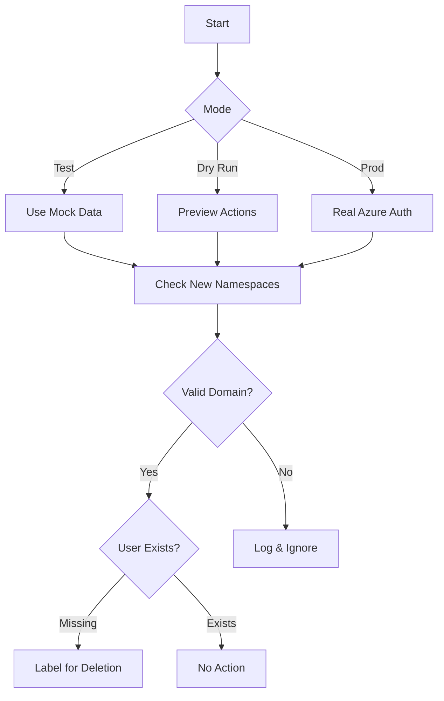
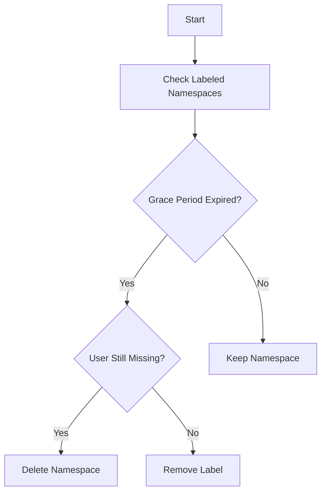

# Kubernetes Namespace Cleaner


<p align="center">
  
</p>

A Kubernetes CronJob that automatically identifies and cleans up namespaces tied to deprovisioned Azure Entra ID (formerly Azure AD) users.

## Development Status
[](https://github.com/StatCan/namespace-cleaner/actions/workflows/ci.yml)


## Overview

### Phase 1: New Namespace Evaluation


### Phase 2: Expired Namespace Cleanup


## Features
- ✅ **Automated Lifecycle Management**: Label-based namespace management
- 🔒 **Security First**: Azure Entra ID integration with domain allowlisting
- 🧪 **Testing Friendly**: Local testing mode with mock data
- ☁️ **Safe Operations**: Dry-run capability for pre-deployment validation

## Quick Start
```bash
# Clone & Setup
git clone https://github.com/StatCan/namespace-cleaner.git
cd namespace-cleaner

# Build and Verify
make build test

# Dry Run Validation
make dry-run

# Production Deployment
make run
```

## CI/CD Integration
Our GitHub Actions workflow provides:
- ✅ Automatic test coverage tracking
- 🔒 Security scanning with Trivy
- 📦 Docker image builds on push
- 📈 Live coverage badge updates

## Configuration
```yaml
# configmap.yaml
apiVersion: v1
kind: ConfigMap
metadata:
  name: namespace-cleaner-config
  namespace: das
data:
  ALLOWED_DOMAINS: "statcan.gc.ca,cloud.statcan.ca"
  GRACE_PERIOD: "90d"  # Format: <number><unit> (h=hours, d=days)
```

## Monitoring & Troubleshooting
```bash
# View logs
kubectl logs -l job-name=namespace-cleaner

# Check cronjob status
kubectl get cronjob namespace-cleaner -o wide

# Full system reset
make stop && make clean && make run
```

## Contributing
1. Fork the repository
2. Create feature branch (`git checkout -b feature/your-feature`)
3. Commit changes with tests (`make test`)
4. Push to branch (`git push origin feature/your-feature`)
5. Open PR with coverage badge verification
